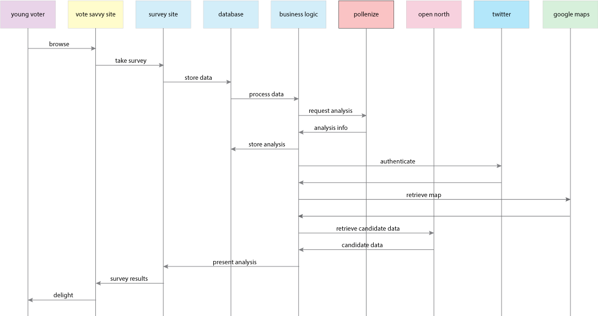

# votesavvy

A resource for young voters to explore voting options, through data and social media.

Need and independent account for:

- [x] Gmail
- [x] Twitter API (they already have twitter so it should be fine)
- [x] Bluemix
- [x] Typeform
- [x] Github
- [x] Zapier

Current features of APIs

1) vote API

  Request example:
   POST /api/vote HTTP/1.1
   Host: localhost:8080
   Content-Type: application/json; charset=utf-8
   Cache-Control: no-cache

   {"voter": "kitten", "postcode": "k2n" }

 Response:
  {
      "voter": "kitten",
      "postcode": "k2n"
  }
  
  
